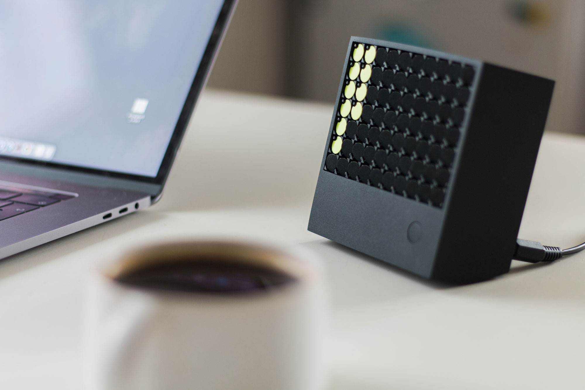
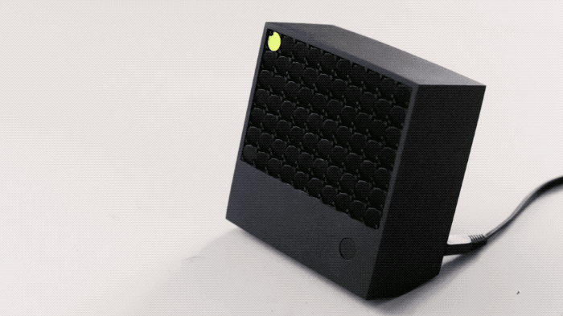
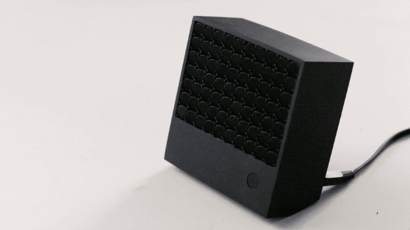
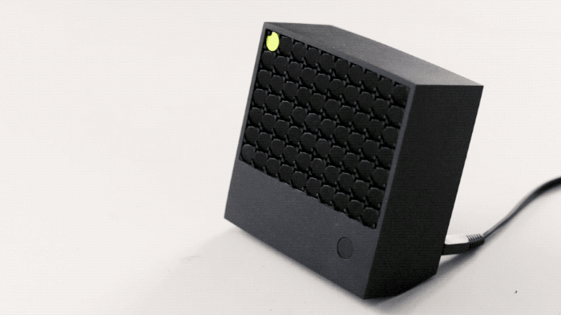

# FlipDot Communicator — Distant Socializing

The *FlipDotCommunicator* is a device for ~~social distancing~~ [distant socializing](https://zirkus-zirkus.com/products/not-alone-bandana).

In these times of high paced, direct digital communication, it is a reminder of the physical and the momentariness. It is a tool to embrace non-explicit communication.

With its soft and erratic flipping sounds, it should bring a little bit of humanness back to our living space. Every message that is received is deleted immediately from the server. When pressing the button, the content is displayed. Once the button is pressed again, the transmission is gone forever. It can stay forever, but thereby it hinders new messages from being received.

It exists in this moment and this moment only—one message at a time. It forces the user to acknowledge the evanescence of a moment, pushing to cherish them more again.

###### Background

This project has been made during the class [Major Studio 1](https://courses.newschool.edu/courses/PGTE5200/1588/) by [Salome Asega](http://www.salome.zone) and [American Artist](https://americanartist.us) in the program [MFA Design & Technology](https://www.newschool.edu/parsons/mfa-design-technology) at Parsons School of Design.

Find the detailed [project blog here](https://olivierbrcknr.github.io/mfadt-ms1-blog/).

## Hardware

This project is built to use [flip-dots](ndsh/flipdots). The little communicator is a hardware piece that receives abstract messages. Here are some examples of how it works:

#### Read A Message

Messages are indicated by the a flipped pixel (see top left). If a message is in the queue and the button is pressed, it is displayed.

#### Queue Is Empty

If no message is in the queue but the button is pressed, a sad icon is displayed for 2 seconds.

#### Timer Starts

If a timer is sent, the current message is saved and the timer starts to run. From start to end, the timer runs for about 3 minutes, filling the screen with dots accordingly.

## Build your own

Find the instructions to build your own hardware prototype in this file → [hardware/README.md](hardware/README.md)

## Website

To send messages, [this website](https://flipdot.vercel.app/) acts as the input device. It allows for granular messaging and will be developed further. Find more about it in this file → [website/README.md](website/README.md)
