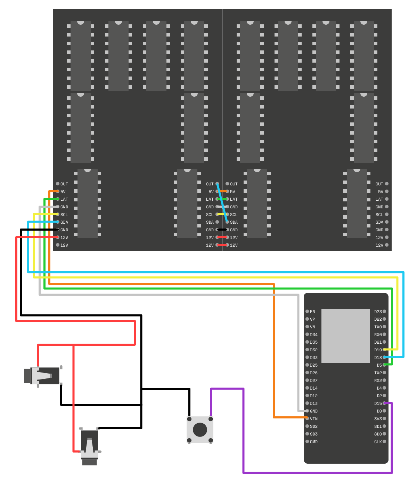
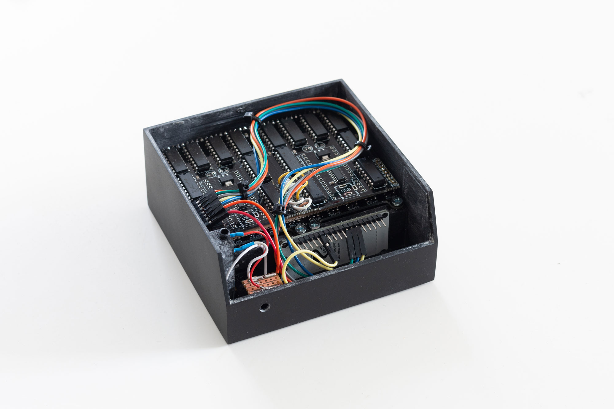

# Hardware Instructions — FlipDot Communicator

## Components used

- 2 Flip Dot Displays 5✕7 from [hannIO](https://hannio.org/)
- ESP32*
- 3 [jack panel sockets](https://secure.reichelt.com/de/en/jack-panel-socket-3-5-mm-stereo-4-pin-smd-lum-1503-13v-p116190.html?&nbc=1)
- Strip board 
- Button (10✕10mm; 7mm)
- AUX cable
- AC/DC adapter 12V 5A**
- 4 M3 nuts
- 4 M3 10mm screws

*I used a [ESP32 DoIt Dev Kit](https://docs.zerynth.com/latest/reference/boards/doit_esp32/docs/). Could be they have different form factors, so check that maybe if you want to use the case I created.

**I use 5A. 1.5A seemed to work sometimes, but was not really reliable. I could not find a documentation specifying which is the minimum current needed.

### Case

Find the `.stl` files in the ["case" folder](case) to print out the housing on a 3D printer. It consists of three elements:

* [The main case](case/MainCase.stl)
* [The back cover](case/BackCover.stl)
* [A button](case/Button.stl)

### FlipDot Matrix

Here you can find the library for the flip dots along with some helpful [instructions](https://github.com/ArduinoHannover/FlipDot_5x7). Also [this video](https://www.youtube.com/watch?v=s-VXi5K4Zl0) is quite helpful to see the parts from different angles. **It's german though!**

I managed to get the two PCBs a little bit closer to each other by going without the accepting header pins and directly soldering them together. This way I could save a couple of millimeters. 

**! Watch out:** The connection to daisychain them is confusingly communicated on [the schematics from hannIO](https://github.com/ArduinoHannover/FlipDot_5x7/blob/master/5x7FlipDotController2-5_Connection_Diagram.pdf), it needs to be the other way around when looking from the back. 

### Wiring Schematics



|ESP32|FlipDot|Button|Color Reference|
|-----|-------|------|---------------|
|VIN  |5V     |-     |Orange         |
|D5   |LAT    |-     |Green          |
|GND  |GND    |Pin   |Gray           |
|D19  |SCL    |-     |Yellow         |
|D18  |SDA    |-     |Blue           |
|-    |GND    |-     |White          |
|-    |12V    |-     |Red            |
|-    |12V    |-     |-              |
|D15  |-      |Pin   |Purple         |

### Final Assembly



## Software

The software for the ESP32 is built using the [Arduino IDE](https://www.arduino.cc/en/software). You can find all the files here → [`FlipDotCommunicator/`](FlipDotCommunicator)

### Libraries to install

You will need to install these libraries for the code to work:

* [ESP32](https://github.com/espressif/arduino-esp32)
* [FlipDot](https://github.com/ArduinoHannover/FlipDot_5x7)
* [Firebase ESP32](https://github.com/mobizt/Firebase-ESP32)

#### Adjustments

I needed to change the pin layout in the [FlipDot_5x7.h](https://github.com/ArduinoHannover/FlipDot_5x7/blob/5966683c8d426884d215b8a05659c2891b238b62/FlipDot_5x7.h#L63-L76) to this one, as it seems to need four analog pins (lines 63-76):

```cpp
#ifndef ESP8266
class FlipDot_5x7_Slave : public FlipDot_5x7 {
	private:
		const uint8_t
			addr1	= 32,
			addr2	= 33,
			addr3	= 34,
			addr4	= 35;
	public:
		FlipDot_5x7_Slave(boolean invert) : FlipDot_5x7(1,1,invert) {}
		void begin(void);
		void receiveEvent(int);
};
#endif /* ESP8266 */
```

### Flash the ESP32

Next, open the [`.ino`](hardware/FlipDotCommunicator/FlipDotCommunicator.ino) file. Add your credentials to the `credentials.h` file. The placeholders are these ones:

```cpp
#define FIREBASE_HOST "YOUR_FIREBASE_PROJECT.firebaseio.com"
#define FIREBASE_AUTH "YOUR_FIREBASE_DATABASE_SECRET"
#define WIFI_SSID "YOUR_WIFI_SSID"
#define WIFI_PASSWORD "YOUR_WIFI_PASSWORD"
```

If you are not sure where to find the Firebase credentials, this [stackoverflow question](https://stackoverflow.com/questions/37418372/firebase-where-is-my-account-secret-in-the-new-console) will help you.

Finally flash it onto the board. Now you should be all set up!